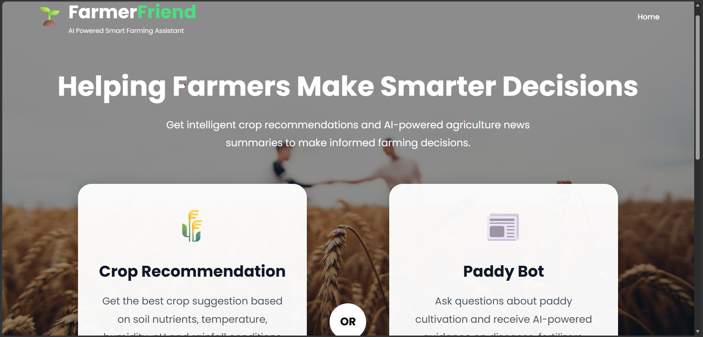
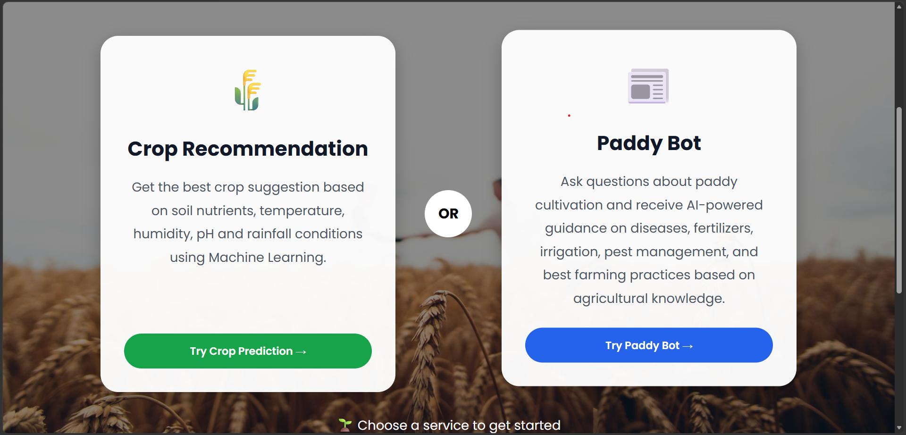
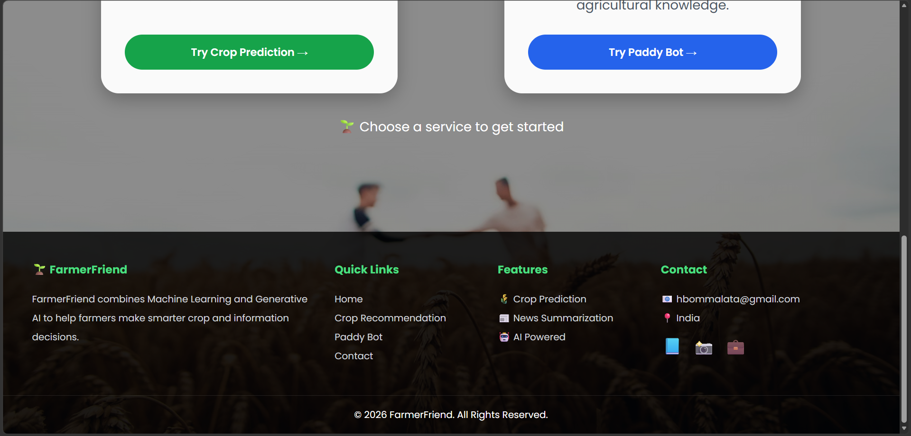
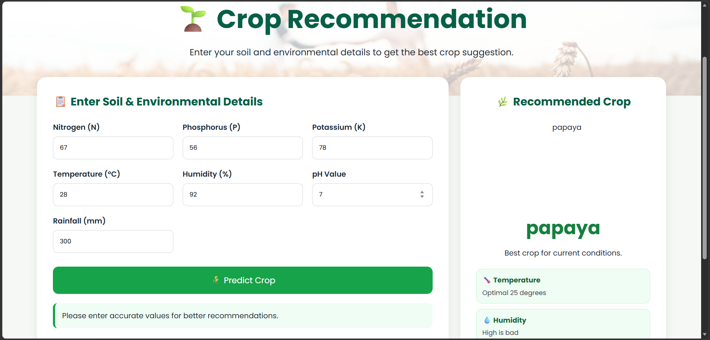
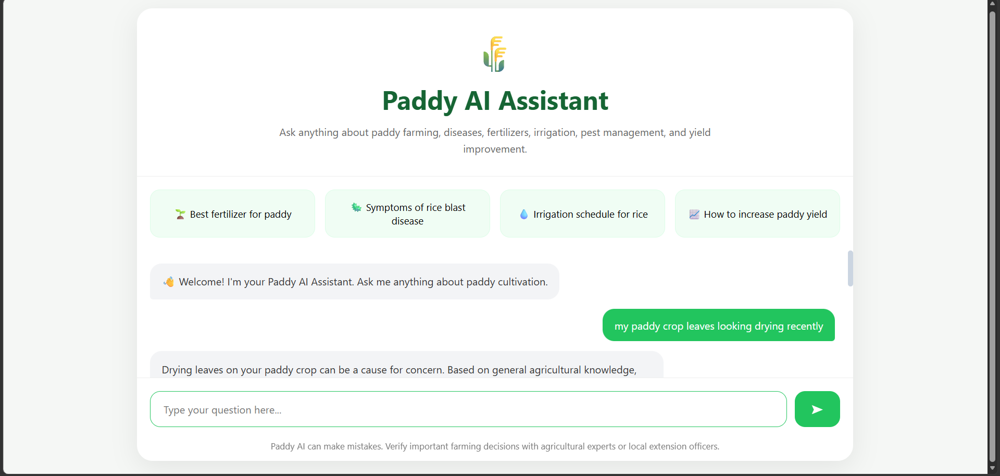

# 🌾 FarmerFriend – AI Powered Smart Farming Assistant

FarmerFriend is a smart agriculture platform that combines **Machine Learning**, **Generative AI**, and **Agricultural Intelligence** to help farmers make informed farming decisions.

The platform provides crop recommendations based on soil and environmental conditions, offers an AI-powered Paddy Assistant for agricultural guidance, and includes agricultural news summarization to keep farmers updated with the latest farming insights.

---

## 🚀 Features

### 🌱 Crop Recommendation System

Predicts the most suitable crop using Machine Learning based on:

* Nitrogen (N)
* Phosphorus (P)
* Potassium (K)
* Temperature
* Humidity
* pH Value
* Rainfall

The system analyzes soil and environmental conditions and recommends the most suitable crop for cultivation.

### 🤖 Paddy AI Assistant

An AI-powered agricultural chatbot that provides guidance on:

* Paddy cultivation
* Fertilizer recommendations
* Disease management
* Irrigation techniques
* Pest control
* Yield improvement strategies
* Best farming practices

The assistant is powered by Large Language Models and provides instant agricultural support.

### 📰 Agriculture News Summarization

AI-powered news analysis system that:

* Processes agricultural news articles
* Generates concise summaries
* Highlights important farming insights
* Saves farmers time by simplifying lengthy news content

### 📊 Smart Farming Support

Provides additional agricultural information including:

* Crop requirements
* Environmental suitability
* Farming recommendations
* Agricultural knowledge assistance

### 🎨 Modern User Interface

* Clean and responsive design
* Agriculture-themed interface
* Mobile-friendly layout
* Easy navigation and user experience

---

## 🏗️ Project Architecture

```text
User
 │
 ▼
Frontend (HTML, CSS, JavaScript)
 │
 ▼
Django Backend
 │
 ├── Crop Recommendation Model
 │
 ├── Paddy AI Assistant
 │
 └── News Summarization Engine
 │
 ▼
Prediction & AI Responses
```

---

## 🛠️ Technologies Used

### Backend

* Python
* Django

### Machine Learning

* Scikit-Learn
* Pandas
* NumPy

### Generative AI

* LangChain
* Groq API
* Hugging Face Transformers

### Frontend

* HTML5
* CSS3
* JavaScript

### Development Tools

* Google Colab
* VS Code
* Git
* GitHub

### Deployment

* Render

---

## 🌱 Crop Recommendation Module

### Input Parameters

| Parameter   | Description               |
| ----------- | ------------------------- |
| Nitrogen    | Soil Nitrogen Content     |
| Phosphorus  | Soil Phosphorus Content   |
| Potassium   | Soil Potassium Content    |
| Temperature | Environmental Temperature |
| Humidity    | Environmental Humidity    |
| pH          | Soil pH Value             |
| Rainfall    | Rainfall Amount           |

### Output

* Recommended Crop
* Crop Suitability Information
* Environmental Recommendations
* Basic Market Trend Information

---

## 🤖 Paddy AI Assistant

The Paddy AI Assistant allows users to ask agricultural questions in natural language.

### Example Questions

* Best fertilizer for paddy?
* Symptoms of rice blast disease?
* Irrigation schedule for rice?
* How to increase paddy yield?
* My paddy leaves are drying recently.
* How can I prevent pest attacks?

### Capabilities

* Conversational AI support
* Agricultural guidance
* Farming recommendations
* Paddy-specific knowledge assistance

---

## 📂 Project Structure

```text
FarmerFriend/
│
├── chatbot/
│   ├── views.py
│   ├── urls.py
│   └── templates/
│
├── recommendation/
│   ├── views.py
│   ├── urls.py
│   └── templates/
│
├── static/
│   ├── css/
│   ├── js/
│   └── images/
│
├── templates/
│
├── farmerfriend/
│   ├── settings.py
│   ├── urls.py
│   └── wsgi.py
│
├── manage.py
├── requirements.txt
└── README.md
```

---

## ⚙️ Installation

### Clone Repository

```bash
git clone https://github.com/harshavardhanBOMMALATA/FarmerFriend.git
```

```bash
cd FarmerFriend
```

### Create Virtual Environment

```bash
python -m venv venv
```

### Activate Environment

#### Windows

```bash
venv\Scripts\activate
```

#### Linux / Mac

```bash
source venv/bin/activate
```

### Install Dependencies

```bash
pip install -r requirements.txt
```

### Configure Environment Variables

Create a `.env` file and add:

```env
GROQ_API_KEY=your_api_key
```

### Run Server

```bash
python manage.py runserver
```

Open:

```text
http://127.0.0.1:8000/
```

---

## 📸 Screenshots

### 🏠 Home Page







### 🌱 Crop Recommendation Page



### 🌾 Crop Prediction Result


### 🤖 Paddy AI Assistant



### 📰 News Summarization Module


---

## 🎯 Project Objectives

* Help farmers choose suitable crops.
* Provide instant agricultural assistance.
* Improve access to farming knowledge.
* Simplify agricultural information.
* Combine AI and Machine Learning for smart farming solutions.

---

## 🔮 Future Enhancements

* Weather Forecast Integration
* Market Price Prediction
* Crop Disease Detection using Computer Vision
* Voice-Based AI Assistant
* Multi-Language Support
* Mobile Application
* Farmer Community Features
* Real-Time Agricultural Alerts

---

## 💡 Key Learning Outcomes

This project helped in gaining practical experience with:

* Django Web Development
* Machine Learning Model Integration
* LangChain Framework
* Large Language Models (LLMs)
* Prompt Engineering
* API Integration
* Frontend Development
* End-to-End AI Product Development

---

## 👨‍💻 Author

Harshavardhan Bommalata

B.Tech – Computer Science Engineering

Skills:

* Python
* Django
* Machine Learning
* LangChain
* Generative AI
* Problem Solving

---

## 📄 License

This project is developed for educational, research, and portfolio purposes.

---

## 📬 Contact

If you have any questions, suggestions, or collaboration opportunities, feel free to reach out.

**Harshavardhan Bommalata**

📧 Email: hbommalata@gmail.com

💼 LinkedIn: https://www.linkedin.com/in/harshavardhan-bommalata-7bb9442b0

🐙 GitHub: https://github.com/harshavardhanBOMMALATA

📍 Location: India

---

## ⭐ Acknowledgements

Special thanks to the open-source communities and tools that made this project possible:

* Django
* Scikit-Learn
* LangChain
* Hugging Face
* Groq
* Python Community

If you found this project useful, consider giving it a ⭐ on GitHub.
